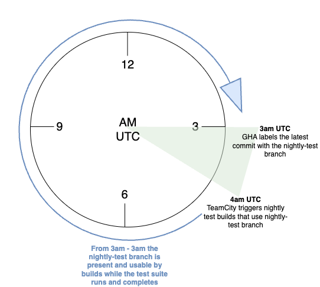
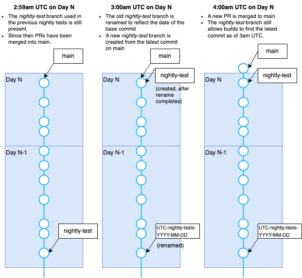

# How TeamCity decides which commit to use for nightly tests

## Background and problem

Our nightly tests are implemented as a build per package in the provider. Previously, a cron schedule triggered each package build independently at 4am UTC. Those builds entered the queue and waited for agents, starting at different times over the approximately 8-10 hour test suite (excluding sweepers). Shared-resource locks prevented conflicting builds but did not synchronize their source revisions.

Independent builds can resolve different source revisions as their branch changes. Early-running builds may use commit A on `main`, while later builds use commit B after another PR merges. The composite build chain described below instead synchronizes source revisions across its package dependencies.

This is a problem as our release cut process assumes that all acceptance tests run on a given night are testing the same commit, and that commit is used to cut the release. If a night’s tests span multiple commits the Release Shepherd will need to analyze multiple builds and identify what commits were tested and determine whether tests pass equally for all those commits (and then decide on a single commit to use for the release cut!).

## Solution

To solve this problem we need to direct TeamCity to checkout a particular commit when running nightly tests.

We retain the `nightly-test` branch to identify the nightly release candidate. Each provider's **All Nightly Tests** composite snapshot-depends on all its package builds, so they use a synchronized source snapshot even when agents start them at different times.

The solution we've implemented includes:

* A GitHub action in the [google](https://github.com/hashicorp/terraform-provider-google/blob/main/.github/workflows/teamcity-nightly-workflow.yaml) and [google-beta](https://github.com/hashicorp/terraform-provider-google-beta/blob/main/.github/workflows/teamcity-nightly-workflow.yaml) repositories that:
    * Runs at **3am UTC**   
    * Renames the previous day's `nightly-test` branch to `UTC-nightly-test-YYYY-MM-DD`, where the date corresponds to when the base commit was made in UTC.
    * Creates a new `nightly-test` branch using the latest commit on the `main` branch
    * Sweeps up old `UTC-nightly-test-YYYY-MM-DD` branches [over 3 days old](https://github.com/hashicorp/terraform-provider-google/blob/5bce89216324fcf9165ef5fc8d1634e55465282b/.github/workflows/teamcity-nightly-workflow.yaml#L83)
* The nightly cron at **4am UTC** triggers the root **All Providers Nightly Tests** composite on `refs/heads/nightly-test`. It snapshot-depends directly on all GA and Beta package builds and both provider-level **All Nightly Tests** composites, so both providers' packages enter the queue together. Neither the provider composites nor the package builds have independent cron triggers.
* Each Service Sweeper uses a finish-build trigger watching its composite on `refs/heads/nightly-test`, without requiring success. It has no snapshot dependencies, so manually running it does not start the test chain.
* The **Nightly Sweeper Gate** starts after **All Providers Nightly Tests** and snapshot-depends on both the GA and Beta Service Sweepers, always running fresh sweeper builds. Global project and folder sweepers use unfiltered finish-build triggers watching this branchless gate, without snapshot dependencies of their own. Their dedicated VCS root defaults to `refs/heads/nightly-test`. See [sweeper orchestration](./PERFORMING_TASKS_IN_TEAMCITY.md#sweepers) for the trigger and locking behavior.

This diagram shows what happens if a new PR was merged to main at 4am when the nightly test builds start running:

  

## What this means for you

[PERFORMING_TASKS_IN_TEAMCITY.md](https://github.com/GoogleCloudPlatform/magic-modules/blob/main/mmv1/third_party/terraform/.teamcity/PERFORMING_TASKS_IN_TEAMCITY.md) has been updated to reflect these changes.

A useful tip is to be aware of this dropdown in the TeamCity UI that allows you to select a given branch. If you select `refs/heads/nightly-test` from the dropdown you will only see builds that have used that branch. 

